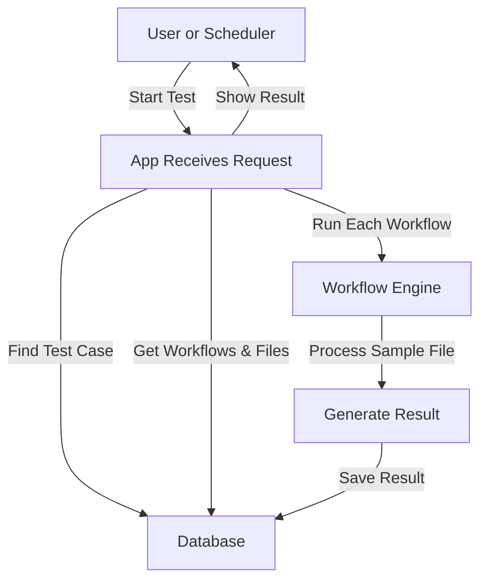

# Test Accelerator Design Document

This document describes the technical architecture and design of the Test Accelerator system.

---

## 1. Architecture Overview

- **Backend:** Flask (Blueprints, SQLAlchemy, Flask-Migrate, Flask-Login, Flask-WTF)
- **Frontend:** Jinja2 templates, Bootstrap 5
- **Database:** SQLite (default, can be swapped for Postgres/MySQL)
- **Scheduler:** APScheduler (for scheduled test case execution)

## 1.1. Entity Relationship Diagram (ERD)

```mermaid
erDiagram
    USER {
        int id PK
        string username
        string email
        string password_hash
        int role_id FK
        datetime date_joined
        datetime last_login
        bool is_active
    }
    ROLE {
        int id PK
        string name
        string description
    }
    PERMISSION {
        int id PK
        string name
        string description
    }
    ROLE_PERMISSIONS {
        int role_id FK
        int permission_id FK
    }
    TESTCASE ||--o{ TESTCASE_WORKFLOW : has
    WORKFLOW ||--o{ TESTCASE_WORKFLOW : has
    TESTCASE_WORKFLOW {
        int id PK
        int test_case_id FK
        int workflow_id FK
        string sample_file (path)
    }
    TESTCASE {
        int id PK
        string name
        string description
        datetime created_at
        datetime updated_at
        string schedule
        datetime next_run_at
    }
    WORKFLOW {
        int id PK
        string name
        string stages
        datetime created_at
        datetime updated_at
    }
    TESTRUN {
        int id PK
        int test_case_id FK
        datetime executed_at
        string status
        text output
        float duration
    }
    CONVERTERCONFIG {
        int id PK
        string name
        string description
        string source_type
        string target_type
        json rules
        json schema
    }
    FILETYPE {
        int id PK
        string name
        string description
        json extraction_rules
        string file_mode
    }
    CONFIGURATION {
        int id PK
        string name
        string description
        int file_type_id FK
        json rules
        json schema
    }
    AUDITLOG {
        int id PK
        int user_id FK
        string action
        string filetype
        datetime timestamp
        text details
    }

    USER ||--o{ ROLE : "role_id"
    ROLE ||--o{ ROLE_PERMISSIONS : "id"
    PERMISSION ||--o{ ROLE_PERMISSIONS : "id"
    TESTCASE }o--|| WORKFLOW : "workflow_id"
    TESTCASE }o--|| CONFIGURATION : "config_id"
    TESTRUN }o--|| TESTCASE : "test_case_id"
    WORKFLOW }o--o{ CONVERTERCONFIG : "stages"
    CONFIGURATION }o--|| FILETYPE : "file_type_id"
    AUDITLOG }o--|| USER : "user_id"
```

- TestCase can have multiple workflows, each with a sample file.
- UI: Add Workflow button, workflow dropdown, file upload per workflow, remove row.
- Uploaded files are saved in uploads/.
- Backend validates at least one workflow, no duplicates.

---

## 2. Main Components

### Blueprints
- `auth`: Authentication, user, role, and permission management
- `config`: Configuration, file type, and converter config management
- `testcases`: Test case and test run management
- `converters`: Workflow and converter execution

### Key Models
- **User**: username, email, password, role, date_joined, last_login
- **Role**: name, description, permissions (many-to-many)
- **Permission**: name, description
- **TestCase**: name, workflow, config, description, schedule, next_run_at
- **TestRun**: test_case, executed_at, status, output, duration
- **Workflow**: name, stages (JSON list of converter config IDs)
- **ConverterConfig**: name, description, source_type, target_type, rules, schema
- **FileType**: name, description, extraction_rules, file_mode
- **Configuration**: name, description, file_type, rules, schema
- **AuditLog**: user, action, filetype, timestamp, details

---

## 3. Database Structure

- All models use SQLAlchemy ORM.
- Alembic/Flask-Migrate for migrations.
- Many-to-many: Role <-> Permission.
- Foreign keys: User -> Role, TestCase -> Workflow, TestRun -> TestCase, etc.

---

## 4. Permission System

- **Universal, fine-grained permissions** (e.g., `testcase_create`, `workflow_manage`, `config_manage`, etc.)
- **Roles** are collections of permissions.
- **Decorators** (`@permission_required`, `@admin_or_permission_required`) enforce access control on all routes.
- **UI** for managing roles, permissions, and user-role assignments.

---

## 5. Scheduler

- **APScheduler** runs as a background process (see `scheduler.py`).
- Picks up test cases with a schedule (daily/weekly) and executes them.
- Results and audit log entries are created.

---

## 6. Cloning Pattern

- All major entities (test case, workflow, converter config, file type, configuration) support cloning.
- Cloning is a POST action, permission-protected, and redirects to the edit page for the new entity.
- Cloned entities have "(Clone)" appended to their name.

---

## 7. UI Structure

- **Base template** (`base.html`) with navigation and permission-aware links.
- **List, detail, and form templates** for all major entities.
- **Bulk actions** and **search/filter** on list screens.
- **Audit log** views for all major entities.

---

## 8. Extensibility Points

- **Add new entity types** by following the blueprint/model/template pattern.
- **Add new permissions** and assign to roles as needed.
- **Swap database** by changing SQLAlchemy URI and running migrations.
- **Integrate with external schedulers** or CI/CD by extending the scheduler logic.

## 10. Data Flow Diagram (DFD)

### Level 1: User Actions

```mermaid
flowchart TD
    A[User] -->|HTTP Request| B[Flask App (View/Route)]
    B -->|Permission Check| C[Permission System]
    B -->|DB Query/Update| D[(Database)]
    B -->|Log Action| E[Audit Log]
    B -->|Schedule/Trigger| F[Scheduler (APScheduler)]
    F -->|Execute| D
    F -->|Log| E
    D -->|Data| B
    E -->|Log Data| B
    B -->|HTML/JSON Response| A
```

### Level 2: Test Case Execution



- User or scheduler starts a test.
- App finds the test case and its workflows/files.
- Each workflow is run with its sample file.
- Results are saved and shown to the user.

---

## 9. Diagrams

### Entity Relationship Diagram (Simplified)

```
User --(role_id)--> Role --(role_permissions)--> Permission
TestCase --(workflow_id)--> Workflow
TestRun --(test_case_id)--> TestCase
Workflow --(stages: JSON)--> ConverterConfig
Configuration --(file_type)--> FileType
AuditLog (generic, links by filetype/name)
```

---

## 10. References
- See `WORKFLOW.md` for business workflows.
- See `README.md` for setup and deployment. 